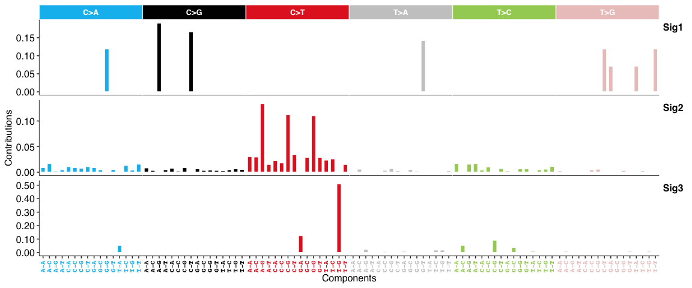
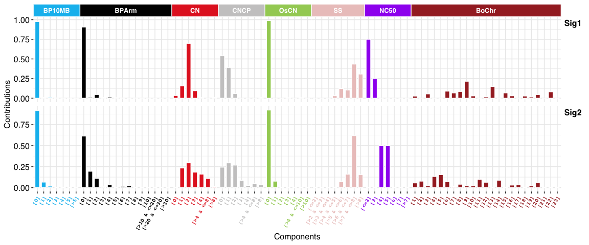
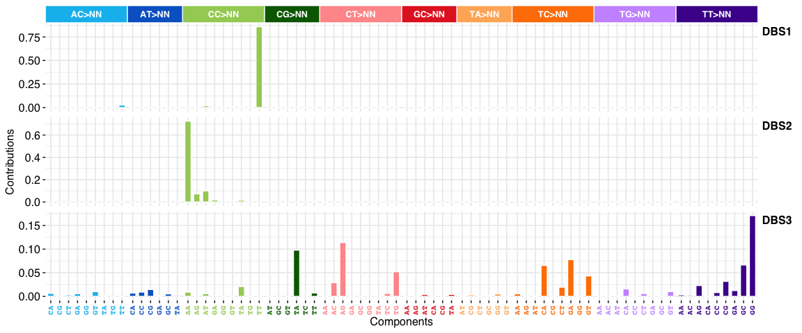
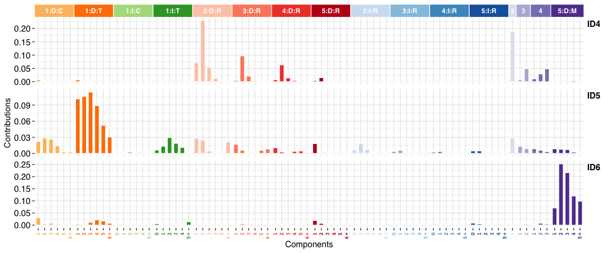
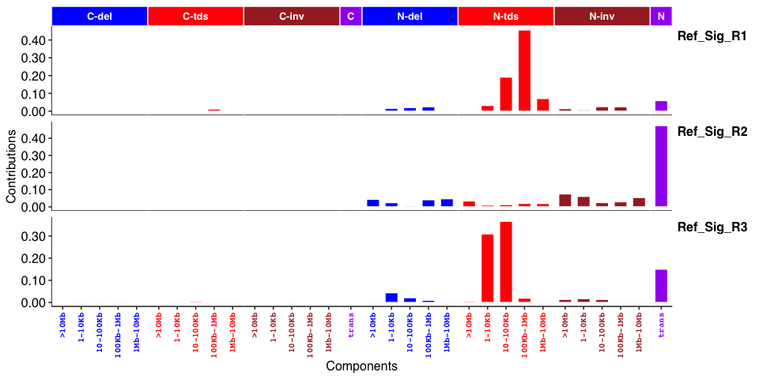

<!-- README.md is generated from README.Rmd. Please edit that file -->

# Sigminer: Mutational Signature Analysis and Visualization in R 

[](https://cran.r-project.org/package=sigminer)
[](https://lifecycle.r-lib.org/articles/stages.html)

[](https://codecov.io/github/ShixiangWang/sigminer?branch=master)
[](https://cran.r-project.org/package=sigminer)
[](https://github.com/ShixiangWang/sigminer/issues?q=is%3Aissue+is%3Aclosed)
[](https://github.com/ShixiangWang/sigminer)
[](https://hits.dwyl.com/ShixiangWang/sigminer/)
[](https://anaconda.org/bioconda/r-sigminer/)

## Overview

The cancer genome is shaped by various mutational processes over its
lifetime, stemming from exogenous and cell-intrinsic DNA damage, and
error-prone DNA replication, leaving behind characteristic mutational
spectra, termed **mutational signatures**. This package, **sigminer**,
helps users to extract, analyze and visualize signatures from genome
alteration records, thus providing new insight into cancer study.

For pipeline tool, please see its co-evolutionary CLI
[sigflow](https://github.com/ShixiangWang/sigflow).

**SBS signatures**:



**Copy number signatures**:



**DBS signatures**:



**INDEL (i.e. ID) signatures**:



**Genome rearrangement signatures**:



> `sig_tally()` for RS is not supported.

### Features

-   supports a standard *de novo* pipeline for identification of **5**
    types of signatures: copy number, SBS, DBS, INDEL and RS (genome
    rearrangement signature).
-   supports quantify exposure for one sample based on *known
    signatures*.
-   supports two methods for calling copy number signatures: one is from
    Macintyre et al. 2018 and the other is created by our group.
-   supports association and group analysis and visualization for
    signatures.
-   supports two types of signature exposures: relative exposure
    (relative contribution of signatures in each sample) and absolute
    exposure (estimated variation records of signatures in each sample).
-   supports basic summary and visualization for profile of mutation
    (powered by **maftools**) and copy number.
-   supports parallel computation by R packages **foreach**, **future**
    and **NMF**.
-   efficient code powered by R packages **data.table** and
    **tidyverse**.
-   elegant plots powered by R packages **ggplot2**, **ggpubr**,
    **cowplot** and **patchwork**.
-   well tested by R package **testthat** and documented by R package
    **roxygen2**, **roxytest**, **pkgdown**, and etc. for both reliable
    and reproducible research.

### Key Interfaces and Their Performances

**Sigminer** provides many approaches to extract mutational signatures.
To test their performances, I use 4 mutation catalog datasets (each
mutation catalog dataset is composed of 30 samples, 10 COSMIC v2 (SBS)
signatures are randomly assigned to each sample with random signature
exposure) from reference \#6. The following table shows how many
signatures can be recovered and the corresponding average cosine
similarity to COSMIC reference signatures for each approach with
settings.

| Approach      | Selection Way        | Setting                                               | Caller                        | Recommend | Driver          | Set1       | Set2       | Set3            | Set4       | Success /Mean | Run time          | Note                                                                                                                                                                |
|:--------------|:---------------------|:------------------------------------------------------|:------------------------------|:----------|:----------------|:-----------|:-----------|:----------------|:-----------|:--------------|:------------------|---------------------------------------------------------------------------------------------------------------------------------------------------------------------|
| Standard NMF  | Manual               | Default. 50 runs (estimation) + 100 runs (extraction) | `sig_estimate`, `sig_extract` | YES ⭐⭐⭐   | R               | 10 (0.884) | 10 (0.944) | 9 or 10 (0.998) | 10 (0.994) | \~90%/0.955   | \~1min (8 cores)  | This is a basic method, suitable for good mutation data with enough mutations.                                                                                      |
| SigProfiler   | **Manual/Automatic** | Default. 100 runs                                     | `sigprofiler_extract`         | YES ⭐⭐⭐⭐  | Python/Anaconda | 10 (0.961) | 10 (0.999) | 10 (0.990)      | 10 (0.997) | 100%/0.987    | \~1h (8 cores)    | A golden standard like approach in this field, but longer run time, and the requirement for Python environment and extra large packages reduce its popularity here. |
| Best Practice | **Manual/Automatic** | Use bootstrapped catalog (1000 runs)                  | `bp_extract_signatures`       | YES ⭐⭐⭐⭐⭐ | R               | 10 (0.973) | 10 (0.990) | 10 (0.992)      | 10 (0.971) | 100%/0.981    | \~10min (8 cores) | My R implementation for methods from reference \#5 and \#6. Should be the best option here.                                                                         |
| Best Practice | **Manual/Automatic** | Use original catalog (1000 runs)                      | `bp_extract_signatures`       | NO :star: | R               | 10 (0.987) | 9 (0.985)  | 10 (0.997)      | 9 (0.987)  | 50%/0.989     | \~10min (8 cores) | This is created to compare with the approach with bootstrapped catalogs above and the standard NMF way.                                                             |
| Bayesian NMF  | **Automatic**        | L1KL+optimal (20 runs)                                | `sig_auto_extract`            | YES ⭐⭐⭐   | R               | 10 (0.994) | 9 (0.997)  | 9 (0.998)       | 9 (0.999)  | 25%/0.997     | \~10min (8 cores) | The Bayesian NMF approach auto reduce the signature number to a proper value from a initial signature number, here is 20.                                           |
| Bayesian NMF  | **Automatic**        | L1KL+stable (20 runs)                                 | `sig_auto_extract`            | YES ⭐⭐⭐⭐  | R               | 10 (0.994) | 9 (0.997)  | 10 (0.988)      | 9 (0.999)  | 50%/0.995     | \~10min (8 cores) | See above.                                                                                                                                                          |
| Bayesian NMF  | **Automatic**        | L2KL+optimal (20 runs)                                | `sig_auto_extract`            | NO :star: | R               | 12 (0.990) | 13 (0.988) | 12 (0.902)      | 12 (0.994) | 0%/0.969      | \~10min (8 cores) | See above.                                                                                                                                                          |
| Bayesian NMF  | **Automatic**        | L2KL+stable (20 runs)                                 | `sig_auto_extract`            | NO :star: | R               | 12 (0.990) | 12 (0.988) | 12 (0.902)      | 12 (0.994) | 0%/0.969      | \~10min (8 cores) | See above.                                                                                                                                                          |
| Bayesian NMF  | **Automatic**        | L1WL2H+optimal (20 runs)                              | `sig_auto_extract`            | YES ⭐⭐⭐   | R               | 9 (0.989)  | 9 (0.999)  | 9 (0.996)       | 9 (1.000)  | 0%/0.996      | \~10min (8 cores) | See above.                                                                                                                                                          |
| Bayesian NMF  | **Automatic**        | L1WL2H+stable (20 runs)                               | `sig_auto_extract`            | YES ⭐⭐⭐⭐  | R               | 9 (0.989)  | 9 (0.999)  | 9 (0.996)       | 9 (1.000)  | 0%/0.996      | \~10min (8 cores) | See above.                                                                                                                                                          |

> NOTE: although Bayesian NMF approach with L1KL or L1WL2H prior cannot
> recover all 10 signatures here, but it is close to the true answer
> from initial signature number 20 in a automatic way, and the result
> signatures are highly similar to reference signatures. This also
> reminds us that we could not use this method to find signatures with
> small contributions in tumors.

## Installation

You can install the stable release of **sigminer** from CRAN with:

``` r
install.packages("sigminer", dependencies = TRUE)
# Or
BiocManager::install("sigminer", dependencies = TRUE)
```

You can install the development version of **sigminer** from Github
with:

``` r
remotes::install_github("ShixiangWang/sigminer", dependencies = TRUE)
# For Chinese users, run 
remotes::install_git("https://gitee.com/ShixiangWang/sigminer", dependencies = TRUE)
```

You can also install **sigminer** from conda `bioconda` channel with

``` sh
# Please note version number of the bioconda release

# You can install an individual environment firstly with
# conda create -n sigminer
# conda activate sigminer
conda install -c bioconda -c conda-forge r-sigminer
```

## Usage

A complete documentation of **sigminer** can be read online at
<https://shixiangwang.github.io/sigminer-doc/> (For Chinese users, you
can also read it at <https://shixiangwang.gitee.io/sigminer-doc/>). All
functions are well organized and documented at
<https://shixiangwang.github.io/sigminer/reference/index.html> (For
Chinese users, you can also read it at
<https://shixiangwang.gitee.io/sigminer/reference/index.html>). For
usage of a specific function `fun`, run `?fun` in your R console to see
its documentation.

## Citation

If you use **sigminer** in academic field, please cite one of the
following papers.

------------------------------------------------------------------------

-   ***Wang, Shixiang, et al. “Copy number signature analyses in
    prostate cancer reveal distinct etiologies and clinical outcomes”
    medRxiv (2020)***
    <https://www.medrxiv.org/content/10.1101/2020.04.27.20082404v1>

-   ***Shixiang Wang, Ziyu Tao, Tao Wu, Xue-Song Liu, Sigflow: An
    Automated And Comprehensive Pipeline For Cancer Genome Mutational
    Signature Analysis, Bioinformatics, btaa895***,
    <https://doi.org/10.1093/bioinformatics/btaa895>

------------------------------------------------------------------------

## Download Stats


## References

Please properly cite the following references when you are using any
corresponding features. The references are also listed in the function
documentation. Very thanks to the works, **sigminer** cannot be created
without the giants.

1.  Mayakonda, Anand, et al. “Maftools: efficient and comprehensive
    analysis of somatic variants in cancer.” Genome research 28.11
    (2018): 1747-1756.
2.  Gaujoux, Renaud, and Cathal Seoighe. “A Flexible R Package for
    Nonnegative Matrix Factorization.”" BMC Bioinformatics 11, no. 1
    (December 2010).
3.  H. Wickham. ggplot2: Elegant Graphics for Data Analysis.
    Springer-Verlag New York, 2016.
4.  Kim, Jaegil, et al. “Somatic ERCC2 mutations are associated with a
    distinct genomic signature in urothelial tumors.” Nature genetics
    48.6 (2016): 600.
5.  Alexandrov, Ludmil B., et al. “Deciphering signatures of mutational
    processes operative in human cancer.” Cell reports 3.1 (2013):
    246-259.
6.  Degasperi, Andrea, et al. “A practical framework and online tool for
    mutational signature analyses show intertissue variation and driver
    dependencies.” Nature cancer 1.2 (2020): 249-263.
7.  Alexandrov, Ludmil B., et al. “The repertoire of mutational
    signatures in human cancer.” Nature 578.7793 (2020): 94-101.
8.  Macintyre, Geoff, et al. “Copy number signatures and mutational
    processes in ovarian carcinoma.” Nature genetics 50.9 (2018): 1262.
9.  Tan, Vincent YF, and Cédric Févotte. “Automatic relevance
    determination in nonnegative matrix factorization with the/spl
    beta/-divergence.” IEEE Transactions on Pattern Analysis and Machine
    Intelligence 35.7 (2012): 1592-1605.
10. Bergstrom EN, Huang MN, Mahto U, Barnes M, Stratton MR, Rozen SG,
    Alexandrov LB: SigProfilerMatrixGenerator: a tool for visualizing
    and exploring patterns of small mutational events. BMC Genomics
    2019, 20:685
    <https://bmcgenomics.biomedcentral.com/articles/10.1186/s12864-019-6041-2>

## LICENSE

The software is made available for non commercial research purposes only
under the
[MIT](https://github.com/ShixiangWang/sigminer/blob/master/LICENSE.md).
However, notwithstanding any provision of the MIT License, the software
currently may not be used for commercial purposes without explicit
written permission after contacting Shixiang Wang
<wangshx@shanghaitech.edu.cn> or Xue-Song Liu
<liuxs@shanghaitech.edu.cn>.

MIT © 2019-Present Shixiang Wang, Xue-Song Liu

MIT © 2018 Geoffrey Macintyre

MIT © 2018 Anand Mayakonda

------------------------------------------------------------------------

[**Cancer Biology Group**](https://github.com/XSLiuLab)
**@ShanghaiTech**

**Research group led by Xue-Song Liu in ShanghaiTech University**
