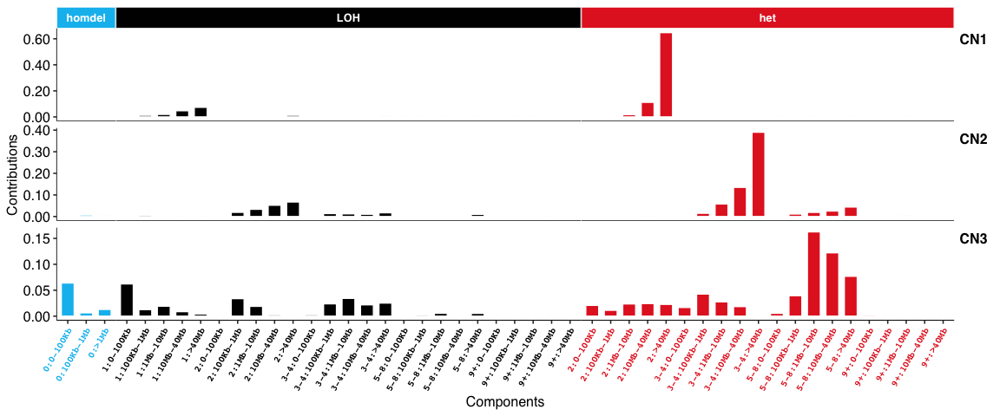
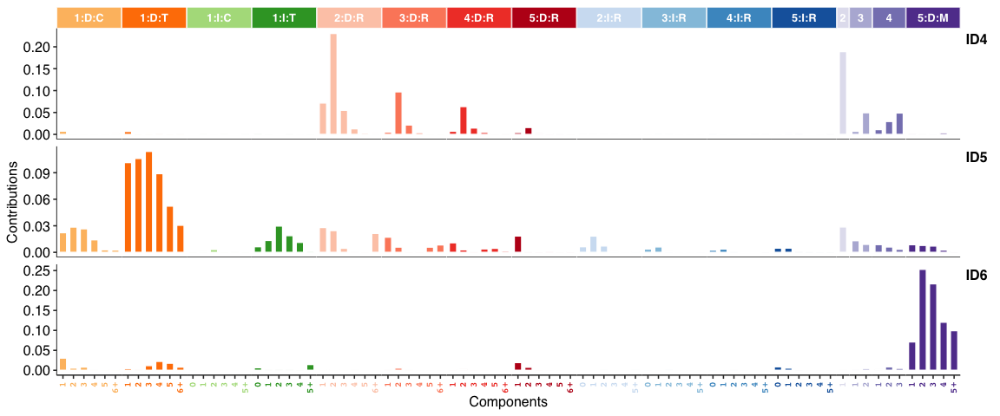
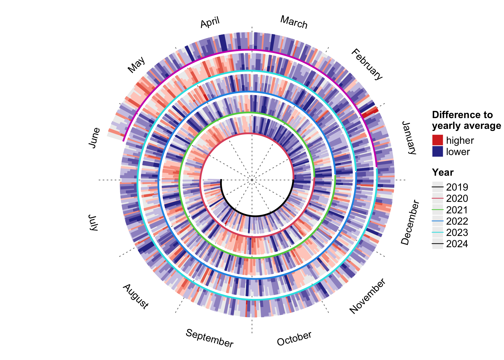

<!-- README.md is generated from README.Rmd. Please edit that file -->

# Sigminer: Mutational Signature Analysis and Visualization in R 

[](https://cran.r-project.org/package=sigminer)
[](https://lifecycle.r-lib.org/articles/stages.html)
[](https://github.com/ShixiangWang/sigminer/actions)
[](https://codecov.io/github/ShixiangWang/sigminer?branch=master)
[](https://cran.r-project.org/package=sigminer)
[](https://github.com/ShixiangWang/sigminer/issues?q=is%3Aissue+is%3Aclosed)
[](https://github.com/ShixiangWang/sigminer)
[](https://hits.seeyoufarm.com)

[](https://biotreasury.rjmart.cn/#/tool?id=10043)
[](https://gitter.im/ShixiangWang/community?utm_source=badge&utm_medium=badge&utm_campaign=pr-badge)

## :bar_chart: Overview

The cancer genome is shaped by various mutational processes over its
lifetime, stemming from exogenous and cell-intrinsic DNA damage, and
error-prone DNA replication, leaving behind characteristic mutational
spectra, termed **mutational signatures**. This package, **sigminer**,
helps users to extract, analyze and visualize signatures from genome
alteration records, thus providing new insight into cancer study.

For pipeline tool, please see its co-evolutionary CLI
[sigflow](https://github.com/ShixiangWang/sigflow).

**SBS signatures**:


**Copy number signatures**:




**DBS signatures**:


**INDEL (i.e. ID) signatures**:



**Genome rearrangement signatures**:


### :airplane: Features

-   supports a standard *de novo* pipeline for identification of **5**
    types of signatures: copy number, SBS, DBS, INDEL and RS (genome
    rearrangement signature).
-   supports quantify exposure for one sample based on *known
    signatures*.
-   supports association and group analysis and visualization for
    signatures.
-   supports two types of signature exposures: relative exposure
    (relative contribution of signatures in each sample) and absolute
    exposure (estimated variation records of signatures in each sample).
-   supports basic summary and visualization for profile of mutation
    (powered by **maftools**) and copy number.
-   supports parallel computation by R packages **foreach**, **future**
    and **NMF**.
-   efficient code powered by R packages **data.table** and
    **tidyverse**.
-   elegant plots powered by R packages **ggplot2**, **ggpubr**,
    **cowplot** and **patchwork**.
-   well tested by R package **testthat** and documented by R package
    **roxygen2**, **roxytest**, **pkgdown**, and etc. for both reliable
    and reproducible research.

## :arrow_double_down: Installation

You can install the stable release of **sigminer** from CRAN with:

``` r
install.packages("BiocManager")
BiocManager::install("sigminer", dependencies = TRUE)
```

You can install the development version of **sigminer** from Github
with:

``` r
remotes::install_github("ShixiangWang/sigminer", dependencies = TRUE)
# For Chinese users, run 
remotes::install_git("https://gitee.com/ShixiangWang/sigminer", dependencies = TRUE)
```

You can also install **sigminer** from conda `bioconda` channel with

``` sh
# Please note version number of the bioconda release

# You can install an individual environment firstly with
# conda create -n sigminer
# conda activate sigminer
conda install -c bioconda -c conda-forge r-sigminer
```

## :beginner: Usage

A complete documentation of **sigminer** can be read online at
<https://shixiangwang.github.io/sigminer-book/>. All functions are well
organized and documented at
<https://shixiangwang.github.io/sigminer/reference/index.html>. For
usage of a specific function `fun`, run `?fun` in your R console to see
its documentation.

## :paperclip: Citation

If you use **sigminer** in academic field, please cite one of the
following papers.

------------------------------------------------------------------------

-   ***Wang S, Li H, Song M, Tao Z, Wu T, He Z, et al. (2021) Copy
    number signature analysis tool and its application in prostate
    cancer reveals distinct mutational processes and clinical outcomes.
    PLoS Genet 17(5): e1009557.***
    <https://doi.org/10.1371/journal.pgen.1009557>

-   ***Shixiang Wang, Ziyu Tao, Tao Wu, Xue-Song Liu, Sigflow: An
    Automated And Comprehensive Pipeline For Cancer Genome Mutational
    Signature Analysis, Bioinformatics, btaa895***.
    <https://doi.org/10.1093/bioinformatics/btaa895>

------------------------------------------------------------------------

## :arrow_down: Download Stats



## :page_with_curl: References

Please properly cite the following references when you are using any
corresponding features. The references are also listed in the function
documentation. Very thanks to the works, **sigminer** cannot be created
without the giants.

1.  Mayakonda, Anand, et al. “Maftools: efficient and comprehensive
    analysis of somatic variants in cancer.” Genome research 28.11
    (2018): 1747-1756.
2.  Gaujoux, Renaud, and Cathal Seoighe. “A Flexible R Package for
    Nonnegative Matrix Factorization.”” BMC Bioinformatics 11, no. 1
    (December 2010).
3.  H. Wickham. ggplot2: Elegant Graphics for Data Analysis.
    Springer-Verlag New York, 2016.
4.  Kim, Jaegil, et al. “Somatic ERCC2 mutations are associated with a
    distinct genomic signature in urothelial tumors.” Nature genetics
    48.6 (2016): 600.
5.  Alexandrov, Ludmil B., et al. “Deciphering signatures of mutational
    processes operative in human cancer.” Cell reports 3.1 (2013):
    246-259.
6.  Degasperi, Andrea, et al. “A practical framework and online tool for
    mutational signature analyses show intertissue variation and driver
    dependencies.” Nature cancer 1.2 (2020): 249-263.
7.  Alexandrov, Ludmil B., et al. “The repertoire of mutational
    signatures in human cancer.” Nature 578.7793 (2020): 94-101.
8.  Macintyre, Geoff, et al. “Copy number signatures and mutational
    processes in ovarian carcinoma.” Nature genetics 50.9 (2018): 1262.
9.  Tan, Vincent YF, and Cédric Févotte. “Automatic relevance
    determination in nonnegative matrix factorization with the/spl
    beta/-divergence.” IEEE Transactions on Pattern Analysis and Machine
    Intelligence 35.7 (2012): 1592-1605.
10. Bergstrom EN, Huang MN, Mahto U, Barnes M, Stratton MR, Rozen SG,
    Alexandrov LB: SigProfilerMatrixGenerator: a tool for visualizing
    and exploring patterns of small mutational events. BMC Genomics
    2019, 20:685
    <https://bmcgenomics.biomedcentral.com/articles/10.1186/s12864-019-6041-2>

## :page_facing_up: LICENSE

The software is made available for non commercial research purposes only
under the
[MIT](https://github.com/ShixiangWang/sigminer/blob/master/LICENSE.md).
However, notwithstanding any provision of the MIT License, the software
currently may not be used for commercial purposes without explicit
written permission after contacting patents’ authors.

Related patents:

-   [CN202011516653.7](https://kms.shanghaitech.edu.cn/handle/2MSLDSTB/127042)

MIT © 2019-Present Shixiang Wang, Xue-Song Liu

MIT © 2018 Anand Mayakonda

------------------------------------------------------------------------

Sigminer v1-v2 are supported by [**Cancer Biology
Group**](https://github.com/XSLiuLab) **@ShanghaiTech**


